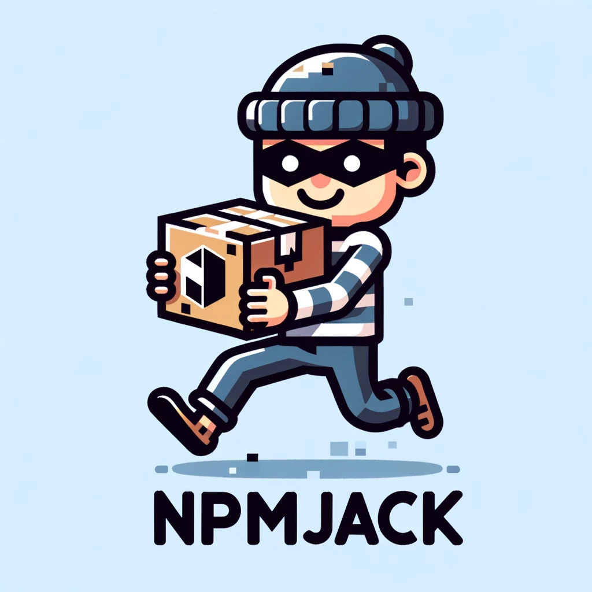

<br>
<div align="center">
  <br>
  
</div>

<br>

<div align="center">
 A tool to find NPM packages in web files and check if they're claimable. Useful for finding dependency confusion bugs.
</div>

<br>


## Installation

### Go
```
go install github.com/root4loot/npmjack@latest
```

### Docker
```
git clone https://github.com/root4loot/npmjack.git && cd npmjack
docker build -t npmjack .
docker run -it npmjack -h
```


## Usage
```
Usage: ./npmjack [options] (-u <url> | -l <target-list>)

TARGETING:
   -u,  --url            target URL
   -i,  --infile         file containing URL's (newline separated)

CONFIGURATIONS:
   -c,  --concurrency    number of concurrent requests       (Default: 10)
   -t,  --timeout        max request timeout                 (Default: 30 seconds)
   -d,  --delay          delay between requests              (Default: 0 milliseconds)
   -r,  --resolvers      file containing list of resolvers   (Default: System DNS)
   -dj, --delay-jitter   max jitter between requests         (Default: 0 milliseconds)
   -ua, --user-agent     set user agent                      (Default: npmjack)

OUTPUT:
   -o,  --outfile        output results to given file
   -hc, --hide-claimed   hide packages that are claimed
   -s,  --silence        silence everything
   -v,  --verbose        verbose output
        --version        display version
```

## Example

**Single URL**
```sh
npmjack -u https://www.hackerone.com/sites/default/files/js/js_C-5Xm0bH3IRZtqPDWPr8Ga4sby1ARHgF6iBlpL4UHao.js
```

**Multiple URLs**
```sh
npmjack -i urls.txt
```

Use [recrawl](https://github.com/root4loot/recrawl) to find all URLs and pipe them to npmjack (which filters out supported file types)

```sh
recrawl -t hackerone.com --hide-status --hide-warning | npmjack
```

## Supported File Types

NpmJack can detect NPM packages in the following file types:

**Configuration Files:**
- `package.json`, `package-lock.json`, `yarn.lock`
- `.eslintrc`, `.babelrc`, `tsconfig.json`
- `webpack.config.js`, `vite.config.js`, `rollup.config.js`

**Source Code:**
- JavaScript (`.js`, `.mjs`, `.cjs`, `.jsx`)
- TypeScript (`.ts`, `.tsx`)
- Vue (`.vue`), Svelte (`.svelte`)
- HTML files with embedded scripts

**CI/CD & Build:**
- `Dockerfile`, `docker-compose.yml`
- GitHub Actions (`.github/workflows/*.yml`)
- `Makefile`

**Documentation:**
- `README.md` and other markdown files
- Code examples and installation commands

## Detection Capabilities

NpmJack can identify packages from various contexts:

- **Import/Require statements** in JavaScript and TypeScript
- **Dependencies** in package.json, yarn.lock, and package-lock.json  
- **Build tool configurations** (webpack, babel, eslint, etc.)
- **CI/CD pipelines** (Docker, GitHub Actions, Makefiles)
- **Documentation examples** (npm install commands in README)
- **Scoped packages** (@babel/core, @types/node, etc.)
- **Version specifiers** (react@^18.0.0, lodash@4.17.21)

## Output

```sh
$ recrawl -t hackerone.com --hide-status --hide-warning | npmjack

PACKAGE                    NAMESPACE            CLAIMED   SOURCE
-------                    ---------            -------   ------
jquery                                          Yes         https://www.hackerone.com/assets/js/app.js
express                                         Yes         https://www.hackerone.com/package.json
@babel/core                @babel/              No          https://www.hackerone.com/webpack.config.js
missing-package                                 No          https://www.hackerone.com/Dockerfile
typescript                                      Yes         https://www.hackerone.com/.github/workflows/ci.yml
```

## As lib

```
go get github.com/root4loot/npmjack@latest
```

```go
package main

import (
	"fmt"

	npmjack "github.com/root4loot/npmjack/pkg/runner"
)

func main() {
	urls := []string{"https://www.hackerone.com/sites/default/files/js/js_Ikd9nsZ0AFAesOLgcgjc7F6CRoODbeqOn7SVbsXgALQ.js",
		"https://www.hackerone.com/sites/default/files/js/js_C-5Xm0bH3IRZtqPDWPr8Ga4sby1ARHgF6iBlpL4UHao.js",
		"https://www.hackerone.com/sites/default/files/js/js_4FuDbOJrjJz7g2Uu2GQ6ZFtnbdPymNgBpNtoRkgooH8.js",
		"https://www.hackerone.com/sites/default/files/js/js_zApVJ5sm-YHSWP4O5K9MqZ_6q4nDR3MciTUC3Pr1ogA.js",
		"https://www.hackerone.com/sites/default/files/js/js_edjgXnk09wjvbZfyK_TkFKU4uhpo1LGgJBnFdeu6aH8.js"}

	// initialize npmjack
	npmjack := npmjack.NewRunner()

	// process results from npmjack
	go func() {
		for result := range npmjack.Results {
			if result.StatusCode == 200 {
				for _, pkg := range result.Packages {
					fmt.Println("Package", pkg.Name, "on", result.RequestURL, "Claimed:", pkg.Claimed)
				}
			}
		}
	}()

	// run npmjack
	for _, url := range urls {
		npmjack.Run(url)
	}
}
```

## Contributing

See [CONTRIBUTING.md](CONTRIBUTING.md)
